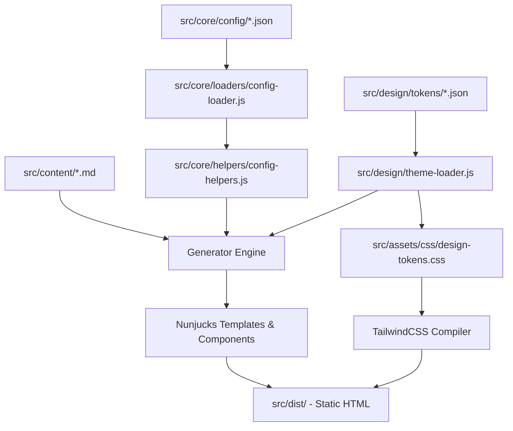
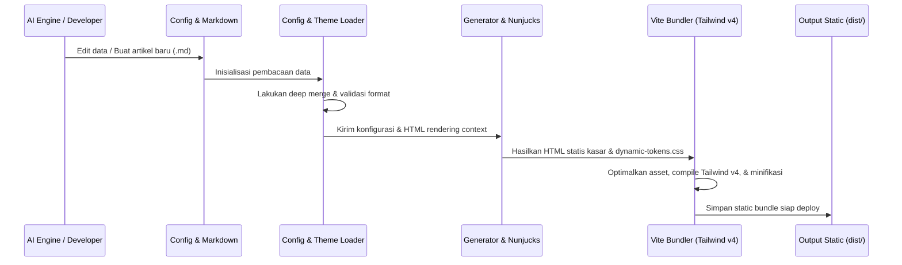

# ARSAR AI Marketing OS v2.0 - Architecture Guide

Dokumen ini mendefinisikan visi, tujuan, dan struktur arsitektural dari **ARSAR AI Marketing OS v2.0**. Framework ini dirancang menggunakan prinsip **Clean Architecture**, **SOLID**, **DRY**, **KISS**, dan **Scalable Architecture** untuk menghasilkan halaman statis super cepat.

---

## 1. Visi & Tujuan Framework
- **Visi**: Menjadi sistem operasi pemasaran (Marketing OS) berbasis static site generator tercepat, teraman, dan paling dapat dikonfigurasi (*highly configurable*) di Indonesia yang ramah AI.
- **Tujuan**:
  - Lighthouse score: Performance >=98, SEO 100, Accessibility >=95, Best Practice 100.
  - Skalabilitas: Reusable untuk puluhan proyek (Arsar Digital, YogaDAI, Dealer, dll) dari satu core engine yang sama.
  - AI-Friendly: Memiliki skema data (JSON/MD) yang mudah dipahami dan dimodifikasi oleh asisten AI.

---

## 2. High-Level Architecture
Framework ini memisahkan kekhawatiran (*separation of concerns*) ke dalam beberapa layer terisolasi:

---

## 3. Deskripsi Layer Sistem

### Core Layer (`src/core/`)
Lapisan terdalam yang menangani logika dasar aplikasi, pemuatan konfigurasi, caching memori, dan validasi skema.
- **Config Loader**: Penanggung jawab pembacaan file setelan sekali saji (*memory-cached*) dengan dukungan merge multi-project.
- **Config Validator**: Melakukan pengecekan format parameter input (email, URL, dll) dan membatalkan build jika terjadi anomali kritis.

### Design Layer (`src/design/`)
Wadah tata kelola token desain atomik (Colors, Typography, Spacing, Radius, dll). 
- **Theme Loader**: Mengubah berkas token JSON menjadi CSS Custom Properties (`--color-primary-600`, dll) sehingga terbebas dari hardcoding di CSS maupun template.

### Component Layer (`src/design/components/`)
Komponen UI modular (Buttons, Cards, Inputs, dll) yang ditulis sebagai **Nunjucks Macros**. Komponen hanya menerima parameter (*props*) dan membaca variabel CSS token, menjadikannya bebas dari logika bisnis.

### Generator Layer (`src/generator/` & `src/playground/`)
Mesin pembangun halaman statis berbasis Node.js. Mengolah data JSON dan Markdown, menyuntikkannya ke dalam komponen makro Nunjucks, dan mengekspornya menjadi file `.html` siap saji.

### SEO & Structured Data Layer (`src/schema/`)
Mengintegrasikan meta tags dinamis (OpenGraph, Twitter Cards) dan Schema.org JSON-LD (LocalBusiness, Organization, FAQ, Breadcrumb) untuk memaksimalkan performa mesin pencari Google.

### Deployment Layer (`src/core/config/deployment.json`)
Menentukan target provider hosting (Cloudflare Pages / Netlify), port server preview, konfigurasi routing bersih (*clean URLs*), dan aturan caching aset.

---

## 4. Alur Aliran Data (Data Flow)

Alur kompilasi data dari masukan mentah hingga menjadi kode produksi statis:

---

## 5. Aturan Dependensi (Dependency Rules)
Untuk memelihara kebersihan arsitektur, patuhi aturan ketergantungan berkas berikut:
1. **No Direct JSON Imports in Components**: Komponen Nunjucks tidak boleh mengimpor file JSON secara langsung. Seluruh data wajib disalurkan melalui parameter makro (*props*) yang disediakan oleh Generator.
2. **Core Isolation**: Kode di dalam `/src/core/` dilarang bergantung pada UI components di `/src/design/components/`. Core harus tetap berupa modul JS murni.
3. **Token Independence**: CSS kustom di `/src/assets/css/` hanya diperbolehkan menggunakan variabel CSS yang terdaftar di dalam `design-tokens.css`. Dilarang menulis nilai hex warna atau ukuran pixel secara langsung.
