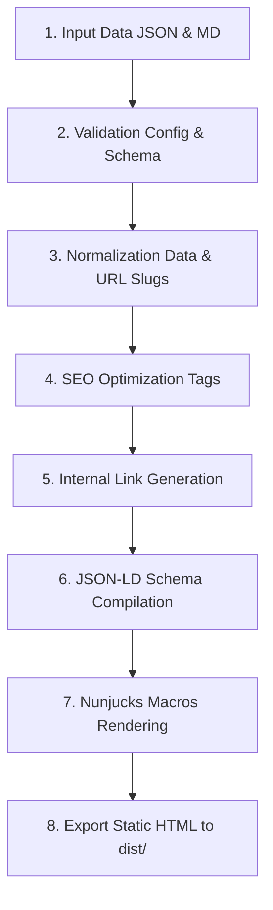

# ARSAR AI Marketing OS v2.0 - Generator Specification

Dokumen ini mendefinisikan pipa saluran (*pipeline*) pemrosesan kompilasi generator halaman statis. Generator bertugas mengolah input data mentah (JSON/Markdown) hingga menghasilkan output file HTML statis siap saji.

---

## 1. Peta Alur Pipeline Generator

Pipeline ini dieksekusi secara berurutan (*sequential steps*) oleh skrip generator (`src/generator/*.js`):

---

## 2. Rincian Langkah Pipeline

### 1. Input Data (JSON & MD)
Generator membaca berkas masukan dari:
- `/src/core/config/`: Konfigurasi situs (`site.json`, `company.json`, dll).
- `/src/data/`: Berkas data berulang (`cities.json`, `services.json`, dll).
- `/src/content/`: Berkas artikel dinamis dalam format Markdown (.md).

### 2. Validation
Menjalankan [config-validator.js](file:///c:/Users/aryo/Documents/Arsardigital/arsar-framework/src/core/validators/config-validator.js) untuk memverifikasi kelayakan data:
- Memastikan parameter penting seperti URL, email, dan nama perusahaan terisi.
- Mencegah proses build lanjut jika ditemukan format data yang salah (*crash early*).

### 3. Normalization
Melakukan pembersihan data (*data cleaning*):
- Membuat slug URL yang valid (huruf kecil, membuang spasi dan karakter spesial).
- Memastikan format penomoran telepon standar internasional (misal: mengganti `08` menjadi `+62`).
- Penataan tanggal ke dalam format lokalisasi bahasa (id-ID).

### 4. SEO Optimization
Menyusun tag meta secara dinamis:
- Menghitung panjang deskripsi dan memotongnya jika melebihi 150 karakter.
- Menyusun judul halaman kustom berdasarkan parameter target proyek/kota.

### 5. Internal Link Generation
Menganalisis relasi antar halaman untuk membangun peta tautan dalam (*internal linking*):
- Otomatis menghubungkan halaman detail layanan dengan formulir kontak.
- Menyusun urutan navigasi breadcrumb list.

### 6. JSON-LD Schema Compilation
Mengompilasi template Schema di `/src/schema/` menjadi untaian JSON-LD terkompresi:
- Membuat Organization schema.
- Menghasilkan LocalBusiness schema per halaman target kota.
- Mengintegrasikan tanya-jawab ke FAQPage schema.

### 7. Nunjucks Macros Rendering
Menyuntikkan data hasil olahan ke dalam Nunjucks templates:
- Merender layout global (`default.njk`, `landing.njk`, dll).
- Mengevaluasi pemanggilan makro komponen (`Button.njk`, `Card.njk`, dll) dengan argumentasi parameter yang sesuai.

### 8. Export (Static HTML)
Menyimpan file hasil render berakhiran `.html` ke dalam direktori target:
- `/src/pages/` selama mode pengembangan (`dev`).
- `/src/dist/` (melalui Vite bundle compiler) untuk hasil kompilasi produksi siap saji (`build`).
