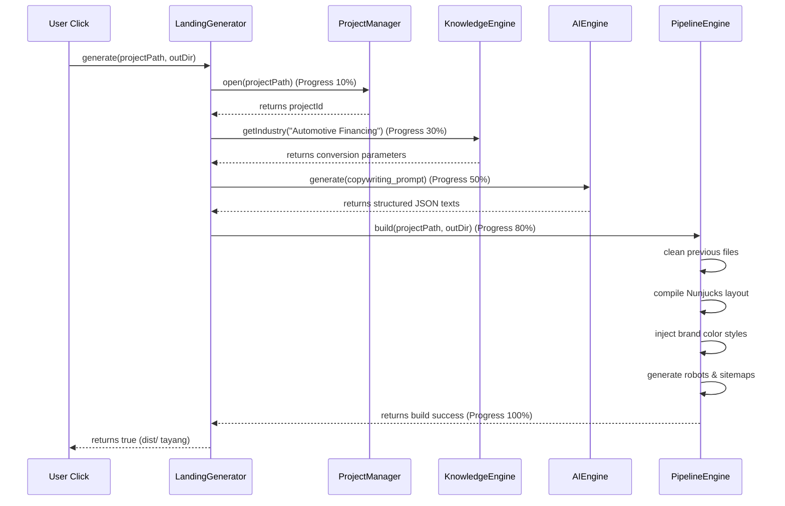

# E2E Build Sequence - Landing Generator

Diagram sekuensial alur perakitan website statis terintegrasi sekali klik (*One Click Generate*):

```mermaid
sequenceDiagram
    participant User as User Click
    participant LG as LandingGenerator
    participant PM as ProjectManager
    participant KE as KnowledgeEngine
    participant AI as AIEngine
    participant PE as PipelineEngine

    User->>LG: generate(projectPath, outDir)
    LG->>PM: open(projectPath) (Progress 10%)
    PM-->>LG: returns projectId
    
    LG->>KE: getIndustry("Automotive Financing") (Progress 30%)
    KE-->>LG: returns conversion parameters
    
    LG->>AI: generate(copywriting_prompt) (Progress 50%)
    AI-->>LG: returns structured JSON texts
    
    LG->>PE: build(projectPath, outDir) (Progress 80%)
    PE->>PE: clean previous files
    PE->>PE: compile Nunjucks layout
    PE->>PE: inject brand color styles
    PE->>PE: generate robots & sitemaps
    PE-->>LG: returns build success (Progress 100%)
    
    LG-->>User: returns true (dist/ tayang)
```
