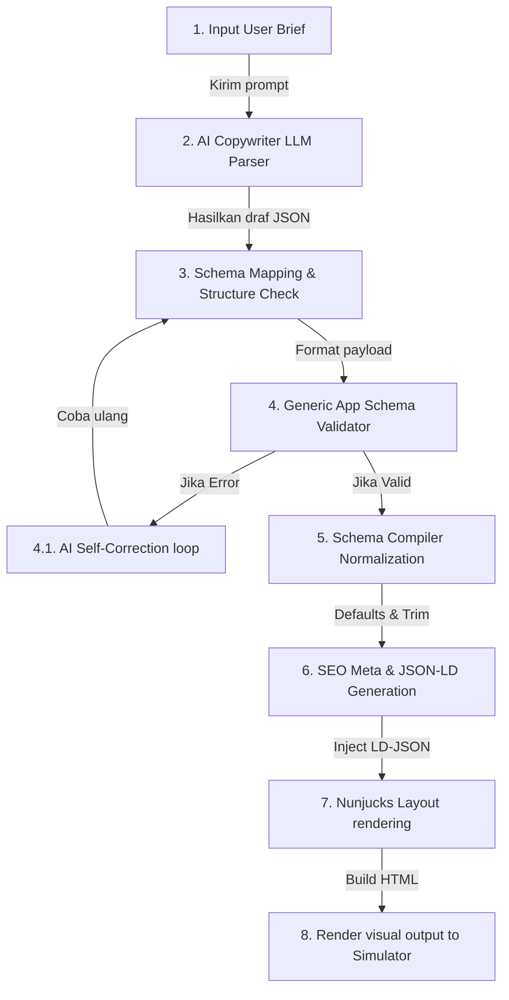

# AI Content Generation Workflow - ARSAR Studio

Dokumen ini mendefinisikan alur kerja asisten AI (*AI-generation pipeline*) dalam menulis dan memformat copywriting terstruktur.

---

## Diagram Alur Pemrosesan AI (AI Content Pipeline)

---

## Rincian Alur Pemrosesan

### 1. User Brief Input
Pengguna memasukkan deskripsi pendek produk/layanan yang ingin diiklankan beserta tone voice target pasar (misal: "Jasa aqiqah cepat dan higienis di Sidoarjo").

### 2. AI Copywriter Parser
LLM memproses brief tersebut menggunakan petunjuk sistem terarah untuk merakit value propositions (benefits), daftar FAQ relevan, ulasan testimoni tiruan pendukung, dan teks tombol aksi (CTA) yang berorientasi pada konversi penjualan.

### 3. Schema Mapping & Validator (AI-Native Gate)
- Output AI dicocokkan dengan Application Schema kontrak data.
- Validator generik memeriksa kelengkapan data wajib. Jika ditemukan parameter kosong, loop perbaikan otomatis (*AI Self-Correction*) dipicu untuk meminta LLM menyusun ulang teks yang kurang hingga lulus 100% valid tanpa kegagalan.

### 4. Compiler Normalization
Mengisi nilai-nilai opsional yang terlewat dengan variabel default skema, memotong spasi kosong yang tidak sengaja terikut, dan mengonversi tipe variabel menjadi data type sejati.

### 5. SEO & Renderer
Menghasilkan tag schema JSON-LD, menyuntikkan ke dalam template layout, dan merender HTML visual statis super cepat.
