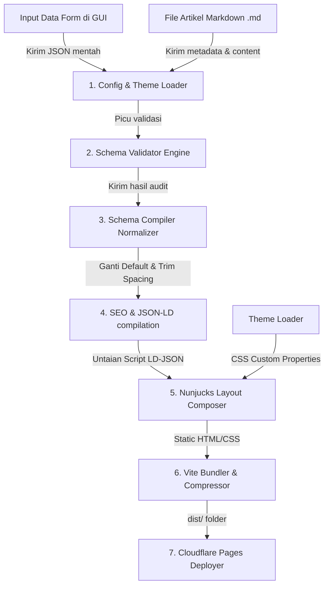

# Data Flow Diagram - ARSAR Studio

Dokumen ini mendefinisikan sirkulasi pertukaran data (*data flow paths*) antar komponen sistem dari masukan mentah hingga file statis statis.

---

## Diagram Aliran Data (Data Flow Diagram)

---

## Rincian Aliran Data

1. **Data Masukan (GUI Form & Markdown)**: Pengguna mengisi formulir profil perusahaan dan menulis postingan blog dalam format Markdown. Data ini dikirim ke Core Loader sebagai payload JSON mentah.
2. **Pintu Penguji (Schema Validator)**: Validator mencocokkan payload JSON dengan Application Schema di Registry untuk mengaudit tipe data dan mendeteksi kesalahan penulisan (seperti format email atau URL yang salah).
3. **Pemberian defaults (Compiler Normalizer)**: Compiler merapikan spasi kosong (*whitespace*) pada teks input, mengonversi tipe variabel (string ke number), dan menyuntikkan nilai default dari skema jika ada field opsional yang kosong.
4. **Perakitan Metadata & Render (SEO & Nunjucks)**: Modul SEO merakit schema JSON-LD, menyisipkannya ke template header, lalu Nunjucks merender HTML statis siap kompilasi.
5. **Ekspor & Publikasi (Vite & Cloudflare)**: Bundler Vite mengompresi ukuran HTML/CSS ke tingkat terkecil lalu deployer mengunggahnya ke Cloudflare Pages.
