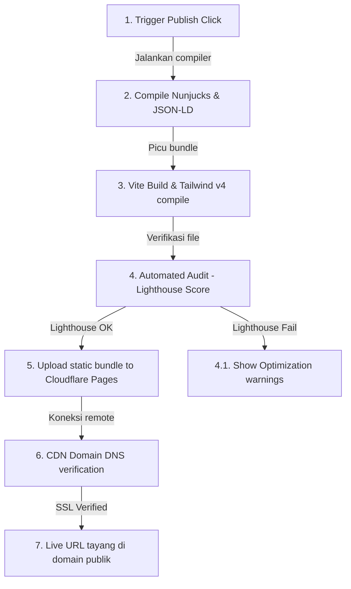

# Deployment Workflow - ARSAR Studio

Dokumen ini menjelaskan alur kerja proses penerbitan (*publishing pipeline*) proyek statis dari kompilasi lokal hingga tayang di web.

---

## Diagram Alur Deployment (Static Publish Pipeline)

---

## Rincian Tahapan Deployment

### 1. Generate & Build (Kompilasi Lokal)
- Sistem merender layout Nunjucks dengan file data JSON dan Markdown.
- Pemuatan TailwindCSS v4 berjalan mengompilasi dynamic-tokens.css menjadi bundle stylesheet terkompresi.
- Vite meminifikasi file output static HTML, CSS, JS di folder `/dist`.

### 2. Automated Audit (Lighthouse check)
- Sebelum diunggah, sistem melakukan pengecekan performa cepat (Lighthouse audit CLI) untuk memastikan tidak ada pemuatan skrip eksternal yang menghambat render halaman (*render-blocking resources*).

### 3. Deploy & Upload
- Bundle folder `/dist` dikirim menggunakan API deployment Cloudflare Pages.
- Cloudflare menyebarkan berkas statis tersebut ke lebih dari 300 data center global secara instan.

### 4. Verify & Publish
- Mengaktifkan sertifikat keamanan SSL HTTPS gratis.
- Menghubungkan alamat domain kustom pengguna. Website statis berkinerja tinggi siap menerima kunjungan iklan.
