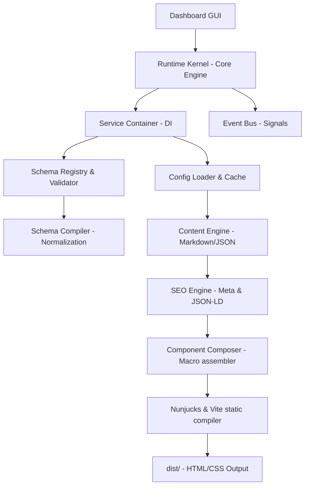

# Module Map - ARSAR Studio

Dokumen ini memetakan relasi ketergantungan dan interaksi antar modul arsitektural di dalam **ARSAR Studio**.

---

## Diagram Hubungan Modul (Module Dependency Graph)

---

## Deskripsi Kerja Antar Modul

### 1. Runtime Kernel (Core)
- **Peran**: Dasar sistem yang memuat event bus, memori cache, logger, dan service container.
- **Relasi**: Mengendalikan pemuatan seluruh modul di atasnya secara teratur (*bootstrapped*).

### 2. Schema Registry
- **Peran**: Wadah pendaftaran data kontrak (Application & SEO schemas).
- **Relasi**: Digunakan oleh Compiler dan Validator untuk memastikan data input bersih sebelum masuk ke pipeline rendering.

### 3. Config Loader
- **Peran**: Memuat parameter setelan web dengan performa memory-cached sekali baca.
- **Relasi**: Menyuplai parameter global (spt URL, data company) ke SEO Engine dan Renderer.

### 4. Content Engine
- **Peran**: Mengubah file tulisan Markdown (.md) dan front-matter menjadi struktur artikel blog.
- **Relasi**: Menyuplai data artikel ke SEO Engine dan Nunjucks layout.

### 5. SEO Engine
- **Peran**: Menyusun meta tags dan menyandikan Schema JSON-LD.
- **Relasi**: Menyisipkan hasil encoding LD-JSON ke dalam template Header HTML utama.

### 6. Component Composer & Renderer
- **Peran**: Merakit Nunjucks Macros UI dengan parameter data gabungan, memanggil compiler TailwindCSS v4, dan mengekspor folder static `dist/`.
- **Relasi**: Hasil output akhir dilepas ke CDN deployment.
