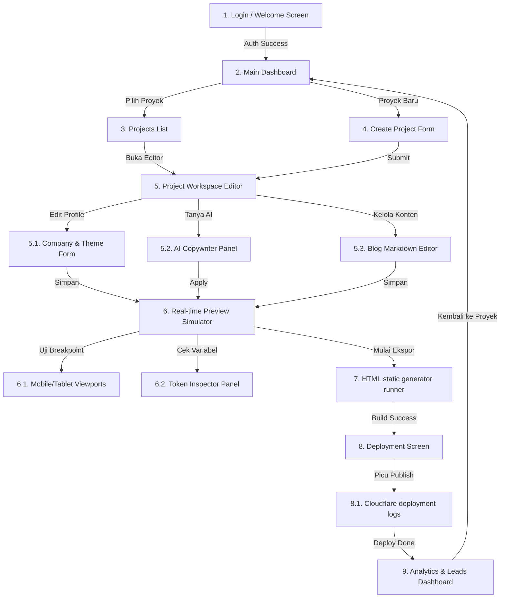

# Screen Flow Map - ARSAR Studio

Dokumen ini menjelaskan peta alur perpindahan antarmuka (*wireflow screen transitions*) di dalam aplikasi **ARSAR Studio**.

---

## Diagram Perpindahan Antarmuka (Screen Transitions Flow)

---

## Deskripsi Fungsional Setiap Antarmuka

1. **Main Dashboard**: Layar selamat datang menampilkan daftar proyek aktif terbaru, statistik kumulatif konversi leads, dan status deployment terakhir.
2. **Project Workspace Editor**: Area kerja utama yang dibagi menjadi tiga sub-panel: editor konfigurasi metadata, panel asisten AI, dan preview render instan.
3. **Real-time Preview Simulator**: Layar simulator responsivitas viewport (Desktop, Tablet, Mobile) yang menyimulasikan layout komponen makro Nunjucks terikat variabel token CSS.
4. **Token Inspector Panel**: Panel inspeksi untuk melihat daftar variabel CSS Custom Properties aktif beserta nilainya.
5. **Deployment Screen**: Menampilkan status build log, visualisasi progress loading bar upload aset ke CDN, dan URL tautan resmi setelah deploy berhasil.
6. **Analytics & Leads Dashboard**: Menampilkan grafik jumlah pengunjung mingguan, rekaman leads formulir kontak masuk, dan klik tombol WhatsApp.
