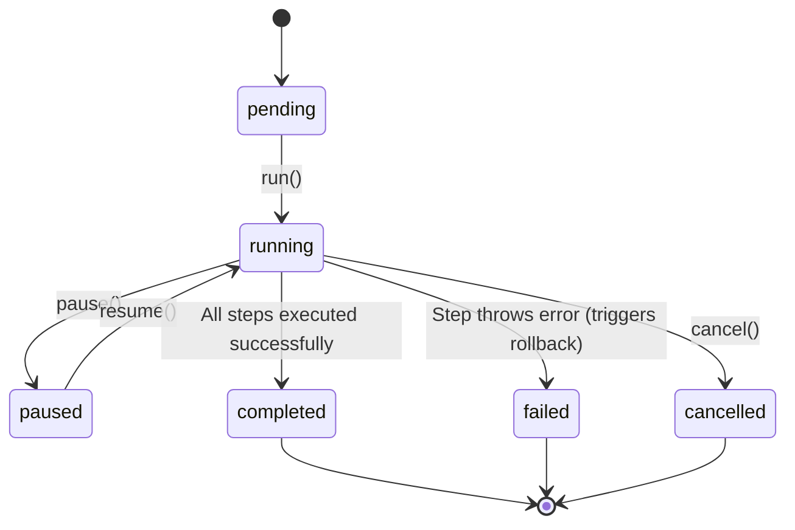

# State Machine - Workflow Engine

State Machine melacak transisi status eksekusi pipa pipeline secara aman:

---

## Deskripsi Transisi Status

- **pending**: Keadaan awal setelah runner dideklarasikan di memori.
- **running**: Proses pembacaan array langkah aktif berjalan bertahap. Timestamp `startedAt` ditandai.
- **paused**: Proses menunggu. Loop pengeksekusi dihentikan sebelum memasuki baris index langkah berikutnya.
- **completed**: Seluruh proses sukses dilewati. Progress ditandai 100% dan file static resmi tayang.
- **failed**: Salah satu langkah melempar exception error. Runner membatalkan eksekusi sisa langkah dan memicu fungsi rollback LIFO.
