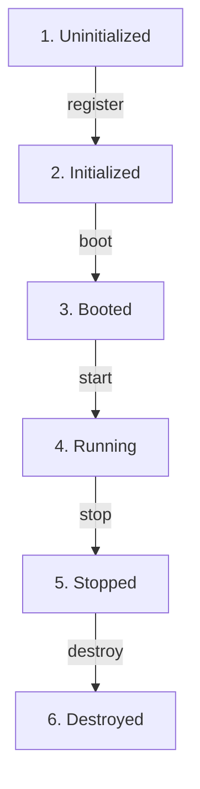

# ARSAR Runtime Kernel

Runtime Kernel adalah jantung penggerak (*execution core*) dari **ARSAR AI Runtime v1**. Kernel ini dirancang murni terisolasi dari domain bisnis (marketing, SEO, generator halaman) untuk menjadi kontainer modul, injeksi dependensi, orkestrasi siklus hidup, dan bus peristiwa.

---

## 1. Siklus Hidup Modul (Module Lifecycle Flow)

Setiap modul yang didaftarkan ke Kernel wajib mewarisi kelas `BaseModule` dan akan dituntun melalui 5 fase transisi siklus hidup secara sekuensial:



### Penjelasan Fase:
1. **initialize(context)**: Memetakan context runtime (project, environment, working directory) ke dalam modul.
2. **boot()**: Mempersiapkan modul (seperti mendaftarkan service lokal ke container).
3. **start()**: Mengaktifkan modul untuk mulai berjalan.
4. **stop()**: Menghentikan proses kerja modul (dijalankan berurutan terbalik LIFO saat kernel dihentikan).
5. **destroy()**: Menghapus memori dan membebaskan referensi context.

---

## 2. Injeksi Dependensi (Service Container)
Injeksi dependensi (*Dependency Injection*) dikelola oleh `ServiceContainer` terpusat. Ini memungkinkan pemisahan kopling (*loose coupling*) antar modul.
- **Transient Binding**: Menghasilkan instansi baru setiap kali di-resolve (`container.register(name, factory)`).
- **Singleton Binding**: Menghasilkan instansi tunggal yang sama di setiap pemanggilan (`container.singleton(name, instanceOrFactory)`).

*Contoh Resolusi:*
```javascript
// Mengambil instansi EventBus terdaftar
const events = container.resolve('events');
```

---

## 3. Alur Bus Peristiwa (Event Flow)
Komunikasi antar modul dilakukan secara asinkronus menggunakan **EventBus** (Pola Publikasi/Langganan - *Pub/Sub*).
- `.on(event, callback)`: Berlangganan event.
- `.emit(event, ...payload)`: Memicu event dan mengirimkan data ke pelanggan.
- `.once(event, callback)`: Berlangganan event sekali saji.

---

## 4. Aliran Sistem Plugin (Plugin Flow)
Plugin murni bertindak sebagai ekstensi kernel yang diinstal melalui `.install(kernel)` dan dihapus melalui `.uninstall(kernel)`. Setiap plugin wajib mewarisi `BasePlugin` dan menyematkan metadata info.

---

## 5. Ringkasan Subdirektori

```text
src/runtime/
├── kernel/                 # Class RuntimeKernel
├── container/              # Class ServiceContainer (Dependency Injection)
├── events/                 # Class EventBus (Pub/Sub)
├── modules/                # BaseModule & lifecycle managers
├── plugins/                # BasePlugin & plugin managers
├── context/                # RuntimeContext (env, project, version)
├── logger/                 # Interface & default ConsoleLogger
├── cache/                  # MemoryCache dengan TTL expiration
├── errors/                 # Kumpulan custom exceptions (RuntimeError, dll)
├── interfaces/             # Logger, Cache, Module, & Plugin interfaces
└── tests/                  # Suite pengujian unit lokal assert JS
```
